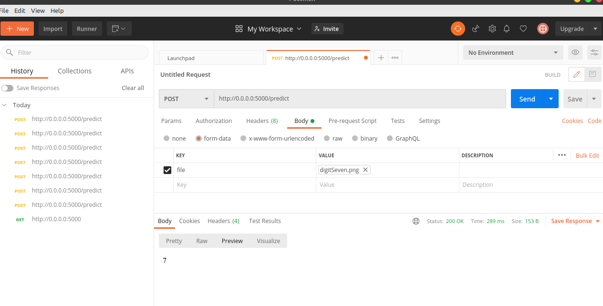
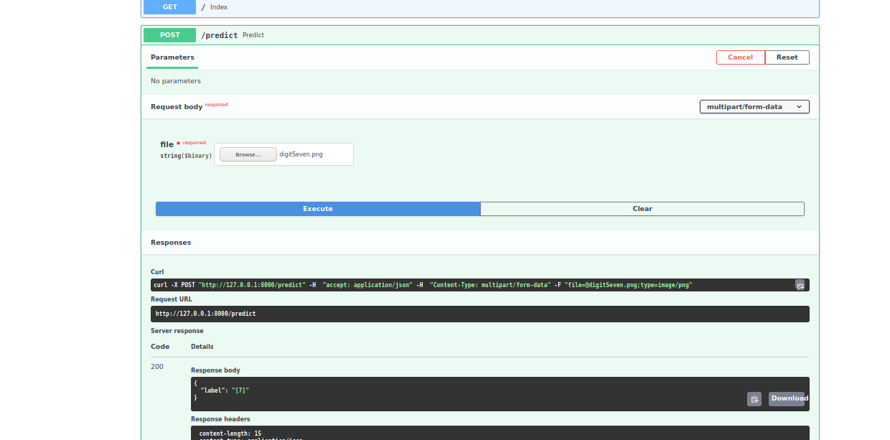

# DigitRecognizer API

### Language used : Python

### Libraries used : Numpy, PIL, Flask, Tensorflow, Image, FastAPI

## Introduction 

The idea behind this app is to build a simple API which can be used as digit recognizer. This is a simple project which is the beginning of Computer Vision and Object Detection.

## Model 

The model which can be found in MNIST_MODEL.ipynb jupyter notebook uses tensorflow library. The model is tested in model_test.ipynb. We can also use Pytorch.

## App 

The app.py is created using Flask API and FAST API . This app was tested using POSTMAN API.
Please find the screenshot below.

## Result

### Using Postman

### Using Flask

